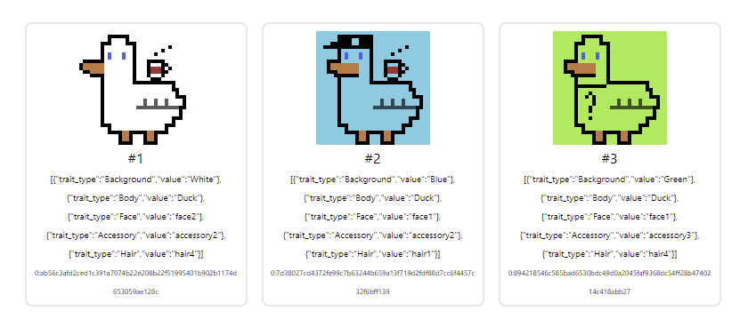

# 🚀 Opensea-like True NFT guide (Images on IPFS)

- 🖼️ Images stored in 🌐 IPFS 
- 📋 Metadata accessed by your own 📄 API

## 1. Generate images and traits

- Install all dependencies
- Prepare your trait layers and put them in `image-sources` directory
- Modify `generator.ipynb` to add your traits and new layers. Also set number of images to generate.
- Run `generator.ipynb` to generate traits and NFT images. Images will be stored in `images-output` directory and traits in `metadata`

## 2. Upload images to IPFS

We are using pinata.cloud for storing images

- Create account on [pinata.cloud](https://pinata.cloud) (Free plan for 1 GB storage)
- Get keys https://app.pinata.cloud/keys (click on admin key toggle), save them to `./uploaders/ipfs-image-uploader.ipynb`
- Run IPFS uploader to upload all of images `./uploaders/ipfs-image-uploader.ipynb`

## 3. Preapare metadata API Server

- Run `api-server-metadata-generator.ipynb` from "uploaders" directory. This script will put metdata link like "http://localhost:8080/token/{id}" for every your token. Change this link to your server URL. Leave unchanged for deployment to local network.
- Navigate to `api-server` directory: `cd api-server`
- Install all dependencies `yarn install`
- Make sure the first command updated "./data/all-metadatas.json" file. The server will try to get metadata from this file.
- Run server `yarn run start:dev`
- Open `http://localhost:8080/swagger`. It is ui for your API.

## 4. Deploy NFT collection to local network

You can test your collection on local machine. First make sure you have installed local blockchain in docker.

- Make sure local blockhcain is running. Run `tondev se start`
- Navigate to "true-nft" directory: `cd true-nft`
- Install all dependencies  `yarn install`
- Run `lerna bootstrap`
- Test with `yarn run test-minter-ipfs`. This command will deploy sample collection to local network. 
- Deploy your generated collection with `yarn run deploy-minter`.
- If you have not created `.env` file in `./true-nft/components/true-nft-core`, then program will generate new MultiSig wallet. Its address and keys will be on screen. Better to create .env file and put there this address and keys to prevent generation of new wallet every time you run this command.
- Keys for this collection will be stored in `test-deploy-result.json` file.
- Copy this file into tnft-explorer for future step: `cp test-deploy-result.json ../tnft-explorer/src`

## 5. View your collection with `tnft-explorer`

- Navigate to "tnft-explorer" directory: `cd ../tnft-explorer`
- Run `yarn install`
- Make sure you have copied test-deploy-result.json file after deploying collection
- Run `yarn start` 
- Open http://localhost:3000/ in your browser  