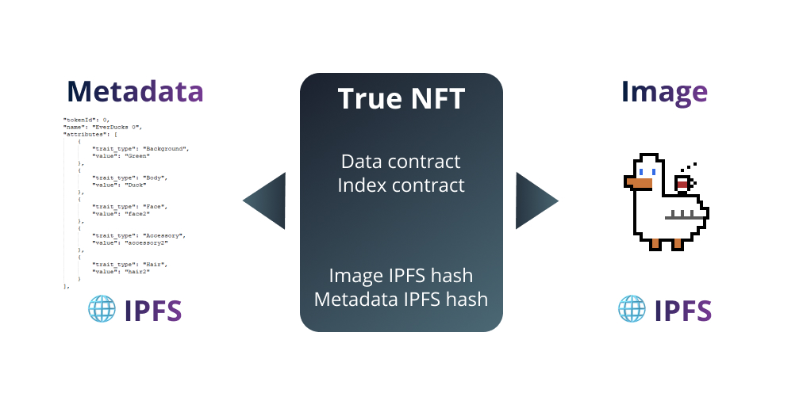

# 🚀 Persistnet True NFT guide (All on IPFS)

- 🖼️ Images stored in 🌐 IPFS 
- 📋 Metadata stored in 🌐 IPFS 

__Watch the video tutorial!__

https://youtu.be/c-uFfD8MCzI

## 1. Generate images and traits

- Install all dependencies
- Prepare your trait layers and put them in `image-sources` directory
- Modify `generator.ipynb` to add your traits and new layers. Also set number of images to generate.
- Run `generator.ipynb` to generate traits and NFT images. Images will be stored in `images-output` directory and traits in `metadata`

## 2. Upload images to IPFS

We are using pinata.cloud for storing images

- Create account on [pinata.cloud](https://pinata.cloud) (Free plan for 1 GB storage)
- Get keys https://app.pinata.cloud/keys (click on admin key toggle), save them to `./uploaders/ipfs-image-uploader.ipynb`
- Run IPFS uploader to upload all of images `./uploaders/ipfs-image-uploader.ipynb`

## 3. Upload metadata to IPFS

You can also upload metadata to IPFS. In this case you will not be able to edit it and add new traits to collection. But it is most simple way to store traits, cause you don't need API server for this.

As with images upload to IPFS we will use pinata.cloud.

Set keys and run `./uploaders/ipfs-metadata-uploader.ipynb`

## 4. Deploy NFT collection to local network

You can test your collection on local machine. First make sure you have installed local blockchain in docker.

- Run `tondev se start`
- Navigate to "true-nft" directory: `cd true-nft`
- Run `yarn install`
- Run `lerna bootstrap`
- Test with `yarn run test-minter-ipfs`. This command will deploy sample collection to local network. 
- Deploy your generated collection with `yarn run deploy-minter`.
- If you have not created `.env` file in `./true-nft/components/true-nft-core`, then program will generate new MultiSig wallet. Its address and keys will be on screen. Better to create .env file and put there this address and keys to prevent generation of new wallet every time you run this command.
- Keys for this collection will be stored in `test-deploy-result.json` file.
- Copy this file into tnft-explorer for future step: `cp test-deploy-result.json ../tnft-explorer/src`

## 5. View your collection with `tnft-explorer`

- Navigate to "tnft-explorer" directory: `cd ../tnft-explorer`
- Run `yarn install`
- Make sure you have copied test-deploy-result.json file after deploying collection
- Run `yarn start` 
- Open http://localhost:3000/ in your browser 