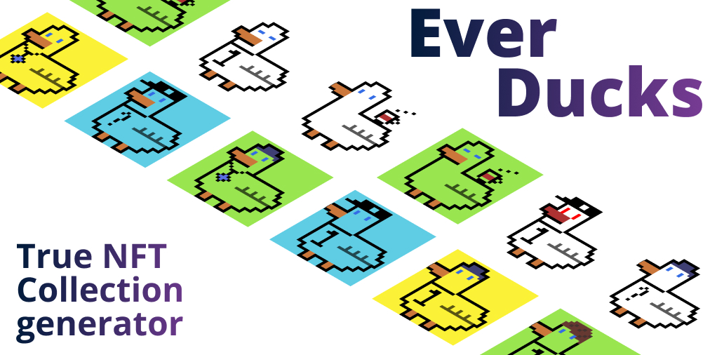
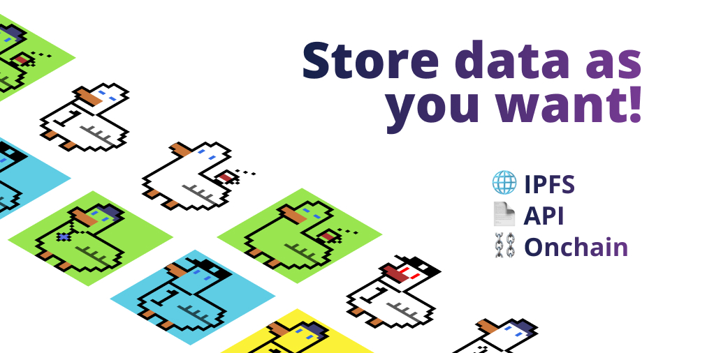
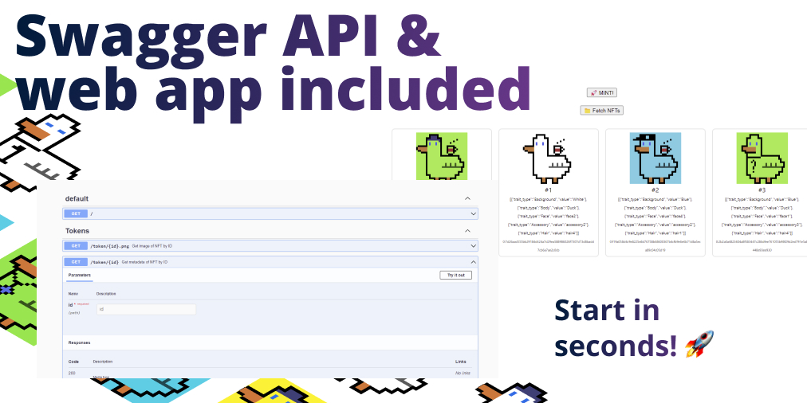
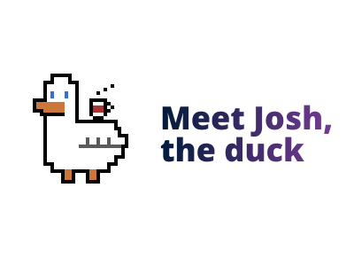

# TrueNFT generative NFT

## 🔮 How it works?

This project helps to create genertive NFT collection on Everscale Blockchain.

In this project we have example images set for EverDucks collection. This images were created in Aseprite (source included). Each layer is also a trait.
NFT image is a mix of different layers. Each layer shuffle and them puts together with image generator. They are highly customizable, you can easily add your own layers.

Layers in this sample (top-down):

- hair
- accessory
- face
- body
- background

## ✨ Get started 

This toolset support several methods and solutions of storing images and matadata

| Approach | 🖼️ Images | 📋 Metadata |
| --- | --- | --- | 
| [Persistent](/docs/persistent-approach-guide.md) | 🌐 IPFS  | 🌐 IPFS |
| [Opensea-like](/docs/opensea-approach-guide.md) | 🌐 IPFS | 📄 API |
| [Simple](/docs/simple-approach-guide.md) | 📄 API | 📄 API |
| tNFT simplified | ⛓️ Onchain | 📄 API |
| tNFT full | ⛓️ Onchain | ⛓️ Onchain |

✅🪢🟢🟡🟠🔮🔗⛓️🗒️📂📁

1. Follow the [🧐 Noobs Guide](/docs/noobs-guide.md) to lear how to setup environment.

2. Choose one of the approaches and follow its deploy guide:

    1. [🌐 Persistent](/docs/persistent-approach-guide.md) 
    2. [🌐📄 Opensea-like](/docs/opensea-approach-guide.md)
    3. [📄 Simple](/docs/simple-approach-guide.md) 

__You can watch the video tutorial!__

## 🪜 Dependencies

Better to run this project in VS Code, but you can use this sources as you want.

- Visual Studio Code
- Python 3.10
- Node.js
- [Tondev](https://github.com/tonlabs/tondev)

Check out [🧐 Noobs Guide](/docs/noobs-guide.md) to lear how to setup and install all this tools.

## Workflow

- [Install all dependencies](/docs/noobs-guide.md)
- Prepare your trait layers and put them in `image-sources` directory
- Modify `generator.ipynb` to add your traits and new layers. Also set number of images to generate.
- Run `generator.ipynb` to generate traits and NFT images. Images will be stored in `images-output` directory and traits in `metadata`
- Upload images. There 3 ways to store them: on IPFS, onchain, on server
- Setup traits API or upload metadata to IPFS
- Deploy collection to blockchain

## 🪐 Uploading images

### IPFS

We are using pinata.cloud for storing images

- Create account on [pinata.cloud](https://pinata.cloud) (Free plan for 1 GB storage)
- Get keys https://app.pinata.cloud/keys (click on admin key toggle), save them to `./uploaders/ipfs-image-uploader.ipynb`
- Run IPFS uploader to upload all of images `./uploaders/ipfs-image-uploader.ipynb`

Proceed with [Persistent approach guide](/docs/persistent-approach-guide.md) or [Opensea-like approach guide](/docs/opensea-approach-guide.md) to learn how to setup collection with images on IPFS.

### Your own server

You can easily store images on your own server or CDN. Just make sure they are accessible via direct link. As `http://localhost/token/1.png`. Proceed with [Simple approach guide](/docs/simple-approach-guide.md) to learn how to use api-server and serve images offchain.

### Onchain

Onchain storage is an Everscale TrueNFT feature. You can put image directly into blockhcian. It is quite expensive and have much limitations.

## 🪐🪐 Uploading metadata

Metadata is your NFT traits

### IPFS

You can also upload metadata to IPFS. In this case you will not be able to edit it and add new traits to collection. But it is most simple way to store traits, cause you don't need API server for this.

As with images upload to IPFS we will use pinata.cloud. Set keys and run `./uploaders/ipfs-metadata-uploader.ipynb`

Proceed with [Persistent approach guide](/docs/persistent-approach-guide.md) to learn how to setup collection with traits and metadata on IPFS.

### API Server

You need to setup API server to serve metadata for your NFTs. It is the same way as traits works on [Opensea](https://docs.opensea.io/docs/2-adding-metadata).

You can easily write your own server or just serve static json files, remember we have generated them to `metadata` directory. In this project there is API Server out of a box. Check out `api-server` directory.

Proceed with [Opensea-like approach guide](/docs/opensea-approach-guide.md) or [Simple approach guide](/docs/simple-approach-guide.md) to learn how to setup API server and serve metadata offchain.

## 🐋 Testing

You can test your collection on local machine. First make sure you have installed local blockchain in docker (tondev node se).

- Run `tondev se start`
- Navigate to "true-nft" directory: `cd true-nft`
- Run `yarn install`
- Run `lerna bootstrap`
- Test with `yarn run test-minter-ipfs`

Next you can use `tnft-explorer` to check out your collection in convinent web interface.

Proceed with [Persistent approach guide](/docs/persistent-approach-guide.md) or [Opensea-like approach guide](/docs/opensea-approach-guide.md) or [Simple approach guide](/docs/simple-approach-guide.md) to learn more.

## 🚀 Deploying

This example shows up how to deploy collection to Devnet.

- Prepare your Multisig wallet (With balance more than 20 EVER ). It will be used to deploy and interact with contracts.
- Make sure all previous steps are complete (images and traits are generated and uploaded).
- Navigate to "true-nft" directory: `cd true-nft`
- Put Multisig wallet address and keys into `.env` file in `components/true-nft-core` directory. There is already `.env.example` file, just replace data and rename this file.
- Run `yarn deploy`
- Don't forget to save NFT Root address, Minter address, and keys (Without it you lost access to your collection). They are printed to console.
- Now you can call `MintNft` method of Minter smart contract and mint first NFT in your collection.
- Also you can setup price for NFT in `Minter.sol` contract. Change value of MINT_FEE before deploy or use setMintFee(uint128 _newFee) function to change price. To transfer funds from this contract use sendTransaction function. You can use mintNftAdmin() function to mint without paying fees.

Proceed with your approach guide to learn more.

## Sources

Made up by the guys who ran the First NFT Collection on EverScale: [waifuston.com](https://waifuston.com). 😎

https://github.com/tonlabs/True-NFT
https://github.com/benyaminahmed/nft-image-generator